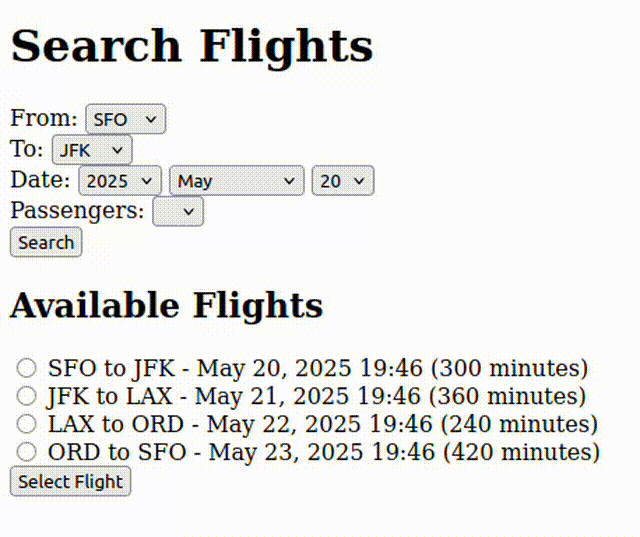

# Odin Flight Booker

This is a simple flight booking application built as part of The Odin Project curriculum. It demonstrates fundamental skills in building a basic web application using Ruby on Rails. The primary focus of this project is to practice implementing forms, validations, associations, and basic CRUD operations.

## Features

* Create, update, and delete flight bookings
* Display a list of available flights
* Simple user interface for booking management
* Backend built with Ruby on Rails

## Installation

### Prerequisites

* Ruby 3.x
* Rails 7.x
* PostgreSQL

### Setup

1. Clone the repository:

   ```bash
   git clone https://github.com/Ajbakaric/odin-flight-booker.git
   cd odin-flight-booker
   ```

2. Install dependencies:

   ```bash
   bundle install
   yarn install
   ```

3. Set up the database:

   ```bash
   rails db:create
   rails db:migrate
   rails db:seed # optional
   ```

4. Start the server:

   ```bash
   rails server
   ```

5. Open your browser at:

   ```
   http://localhost:3000
   ```

## Usage

* Navigate to the homepage to view available flights.
* Use the booking form to reserve a flight.
* Manage your bookings through the bookings page.

## Screenshot

## Preview



## Acknowledgments

This project was completed as part of The Odin Project's Ruby on Rails curriculum. It serves as a practical exercise in building a basic web application.
